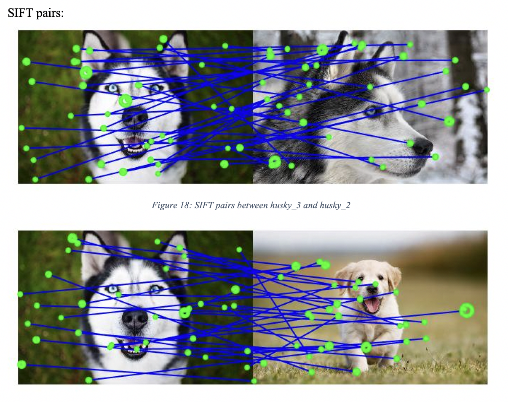

# Image-Matching-and-Bag-of-Words
Bag Of Visual words is similar to Bag of Words which is an algorithm used in the field of NLP, where as here we use BoVW on images. It is majorly used for image retrival and object detection. Here we extract the features of a query image. In this assignment, we are asked to use unsupervised learning method to create clusters of the features extracted to form a codeword of each images. From each codeword we are asked to create 8 bins. Then we find the intersection between the histograms created out of the bins and determine the images that match the most. 
## Approach:
To perform image matching using Bag of Visual words, from each image we first detect the features and their descriptors using SIFT or SURF algorithms. Using the k means clustering algorithm we create clusters of the features obtained. The centroids of each clusters are considered as a vocabulary’s part in the dictionary or codewords created. Then we plot the histograms for visualizing the frequency of the visual words occurring. At last we either find the error between the histogram of each image or intersection to find the best match of the query image. 

